# FenoClima — Documentação Técnica Completa

> Pipeline de predição de produtividade da soja em nível municipal, integrando fenologia derivada de satélite com indicadores climáticos e uma rede neural híbrida.

---

## Sumário

1. [Visão Geral do Projeto](#1-visão-geral-do-projeto)
2. [Estrutura do Repositório](#2-estrutura-do-repositório)
3. [Pipeline de Processamento](#3-pipeline-de-processamento)
4. [Módulo 1 — Extração de NDVI (`big_query-gee.py`)](#4-módulo-1--extração-de-ndvi-big_query-geepy)
5. [Módulo 2 — Métricas Fenológicas (`timesat.py`)](#5-módulo-2--métricas-fenológicas-timesatpy)
6. [Módulo 3 — Indicadores Climáticos (`clima_timesat.py`)](#6-módulo-3--indicadores-climáticos-clima_timesatpy)
7. [Módulo 4 — Rede Neural Híbrida (`FenoClima.py`)](#7-módulo-4--rede-neural-híbrida-fenoclimapymodulo-4)
8. [Diagrama da Metodologia](#8-diagrama-da-metodologia)
9. [Formatos de Entrada e Saída](#9-formatos-de-entrada-e-saída)
10. [Parâmetros e Configurações](#10-parâmetros-e-configurações)
11. [Limitações Conhecidas](#11-limitações-conhecidas)

---

## 1. Visão Geral do Projeto

O **FenoClima** é um sistema de previsão de produtividade agrícola municipal que combina três fontes de dados:

| Fonte | Tipo | Representação |
|-------|------|---------------|
| Satélite MODIS | Séries temporais de NDVI (250 m) | Fenologia da cultura |
| Reanálise climática | Temperatura e precipitação diária | Condições agrometeorológicas |
| Censo agropecuário (IBGE) | Produtividade histórica municipal | Variável-alvo e tendência tecnológica |

**Hipótese central**: A produtividade observada pode ser decomposta em dois componentes:

```
produtividade(t) = tendência_tecnológica(t) + desvio_climático(t)
```

O modelo aprende apenas o `desvio_climático`, enquanto a `tendência_tecnológica` é extraída via regressão linear histórica por município. Isso torna o modelo agnóstico a ganhos de produtividade de longo prazo e focado nos efeitos interanuais do clima e da fenologia.

---

## 2. Estrutura do Repositório

```
FenoClima/
├── big_query-gee.py       # Extração de NDVI no Google Earth Engine / BigQuery
├── timesat.py             # Detecção de métricas fenológicas (adaptação do TIMESAT)
├── clima_timesat.py       # Cálculo de indicadores climáticos por fase fenológica
├── FenoClima.py           # Orquestração de features + treinamento da RNA híbrida
├── diagram.png            # Diagrama arquitetural da rede neural
├── terminal-print.txt     # Saída do console ao final do treinamento
├── resultado-dados-test.csv  # Predições no conjunto de teste (anos não vistos)
└── README.md              # Descrição resumida do projeto
```

---

## 3. Pipeline de Processamento

O fluxo completo é sequencial em quatro etapas:

```
[MODIS / GEE]           Stage 1: big_query-gee.py
      ↓                 Séries temporais de NDVI por município
[NDVI CSV]

      ↓                 Stage 2: timesat.py
[Fenologia CSV]         Métricas fenológicas por safra

      ↓                 Stage 3: clima_timesat.py
[Fenologia+Clima CSV]   Indicadores climáticos alinhados às fases

      ↓                 Stage 4: FenoClima.py
[Predição CSV]          Treinamento + predição de produtividade
```

---

## 4. Módulo 1 — Extração de NDVI (`big_query-gee.py`)

### Objetivo
Calcular o NDVI médio diário por município brasileiro, aplicando máscara de área plantada com soja (MapBiomas) e máscara de nuvens.

### Fonte de Dados
- **Imagens**: MODIS MOD09Q1 (250 m, 8 dias)
- **Máscara de soja**: MapBiomas (coleção via GEE Asset)
- **Shapefile municipal**: IBGE BR_Municipios_2024

### Processamento

1. **Filtragem temporal**: seleciona coleção MODIS pelo intervalo `YEAR_START`–`YEAR_END`
2. **Máscara de nuvens**: bits 10–11, 2 e 8–9 do band `State` do MOD09Q1
3. **Cálculo do NDVI**: `(NIR - RED) / (NIR + RED)` usando bandas 2 e 1
4. **Redução espacial por município**: por lote de 1 município (`CHUNK_SIZE = 1`)
5. **Estatísticas computadas**:
   - `ndvi_mean`, `ndvi_stdDev`, `ndvi_p5`, `ndvi_p50`, `ndvi_p95`
   - `area_total_soja`, `area_nuvem_soja`, `pct_cloud_soy`
6. **Exportação**: CSV para Google Drive (`gee_exports/`)

### Saída
```
D1C | date | ndvi_mean | ndvi_stdDev | ndvi_p5 | ndvi_p50 | ndvi_p95 | area_total_soja_sum | area_nuvem_soja_sum | pct_cloud_soy
```

---

## 5. Módulo 2 — Métricas Fenológicas (`timesat.py`)

### Objetivo
Detectar as fases fenológicas de cada safra a partir da série temporal de NDVI municipal (adaptação do método TIMESAT).

### Algoritmo Principal

#### 5.1 Detecção de Picos
- `scipy.signal.find_peaks` com `distance=16 dias`, `height=0.65`
- Pixels com `pct_cloud_soy > 70%` são mascarados (NaN)

#### 5.2 Ajuste de Curva (`ajustar_curva_safra`)
Ajuste de função logística dupla a uma janela de ±105 dias em torno do pico:

```
f(t) = a / (1 + exp(-b(t-c₁))) + d / (1 + exp(-e(t-c₂))) + f₀
```

- Fallback para polinômio quadrático se o ajuste logístico falhar
- A curva é escalada para coincidir com o valor de pico observado

#### 5.3 Suavização (`aplicar_savitzky_golay`)
- Interpolação cúbica para frequência diária
- Filtro Savitzky-Golay: `window=33`, `polyorder=1`

#### 5.4 Extração de Parâmetros Fenológicos (`parametros_safra_curva_df`)

| Parâmetro | Descrição |
|-----------|-----------|
| **SOS** | Start of Season — primeiro valor de NDVI > 0 antes do pico |
| **POS** | Peak of Season — valor máximo de NDVI |
| **EOS** | End of Season — primeiro valor de NDVI > 0 após o pico |
| **MOS** | Middle of Season — 80% da amplitude (max−min) |
| **ROI** | Rate of Increase — inclinação polinomial em 10–80% da amplitude |
| **ROD** | Rate of Decrease — inclinação polinomial na fase descendente |
| **LOS** | Length of Season — dias entre SOS e EOS |
| **AOS** | Amplitude — POS menos NDVI basal |
| **SIOS** | Integral — área sob a curva (integração trapezoidal) |

#### 5.5 Regras de Validação

| Código de Erro | Critério de Rejeição |
|---------------|----------------------|
| 1 | Pico detectado em junho–setembro (entressafra) |
| 2 | Plantio (data_ini) em abril–julho |
| 3 | Colheita (data_fim) em julho–novembro |
| 4–8 | Ciclo fora do intervalo 90–240 dias |

### Saída
CSV por município com colunas fenológicas por safra detectada.

---

## 6. Módulo 3 — Indicadores Climáticos (`clima_timesat.py`)

### Objetivo
Calcular variáveis agrometeorológicas **alinhadas às fases fenológicas** de cada safra/município, em vez de usar janelas de calendário fixas.

### Dados de Entrada
- **Temperatura**: TMED, TMAX, TMIN (formato `.zarr`)
- **Precipitação**: PREC (formato `.zarr`)
- **Normais climatológicas**: NetCDF (`tmed/tmax/tmin/prec_climatology.nc`)
- **Produtividade histórica**: pickle (`safras_municipios_2000-2024.pkl`) — fonte IBGE
- **Fenologia**: saída do `timesat.py`

### Indicadores Calculados

#### Graus-Dia de Crescimento (GDD)
```
TB = 38°C  (temperatura base superior)
Tb =  9°C  (temperatura base inferior)
```
Calcula 6 casos possíveis de sobreposição do intervalo [Tmin, Tmax] com [Tb, TB], seguindo o método de integração trapezoidal triangular.

#### Anomalia Climática
```
anomalia(t) = valor_observado(t) - normal_climatológica(DOY_t)
```
O DOY (dia do ano) é calculado sem o dia 29/fev para consistência interanual.

#### Índice de Precipitação Padronizado (SPI)
```
SPI = (prec_acumulada_safra - média_histórica) / desvio_padrão_histórico
```
Calculado sobre o ciclo completo da safra.

#### Indicadores por Fase

| Fase | Período | Variáveis |
|------|---------|-----------|
| Plantio | `data_ini` → `MOS_DT1` | `prec_plantio`, `gdd`, temperatura |
| Reprodutivo | `MOS_DT1` → `MOS_DT2` | `prec_safra`, `tmax_mean`, `tmed_mean` |
| Colheita | `MOS_DT2` → `data_fim` | `prec_colheita`, anomalias de temperatura |
| Ciclo completo | `data_ini` → `data_fim` | SPI, GDD total, anomalias agregadas |

### Saída por Município

```
Térmicas: gdd | tmin_min | tmin_mean | tmin_anom | tmed_mean | tmed_std | tmed_anom | tmax_mean | tmax_max | tmax_anom
Hídricas:  prec_safra | prec_anom_safra | spi | prec_plantio | anom_prec_plantio | prec_colheita | anom_prec_colheita
```

---

## 7. Módulo 4 — Rede Neural Híbrida (`FenoClima.py`)

### 7.1 Carregamento e Filtragem dos Dados

1. Carrega CSVs de `/home/admin2/datain/complete_timesat/`
2. Faz merge com coordenadas municipais (`BR_Municipios_2024.zip`)
3. Converte datas fenológicas para DOY (dia do ano)
4. Calcula `MOSL` = dias entre `MOS_DT1` e `MOS_DT2`

**Filtros aplicados**:
- Remove entradas duplicadas `(cod, ano)`, mantendo menor `data_max`
- Remove municípios com <5 registros históricos (até 2022)
- Retém apenas registros com `ERROR == 0`

---

### 7.2 Separação Tecnologia × Clima

#### Tendência Tecnológica (`criar_features_com_tecnologia`)

```
prod_baseline_tec(mun, ano) = intercepto_mun + slope_mun × ano
```

- Slope negativo por município → substituído pelo slope nacional (tendência não regride)
- `prod_desvio_tec` = produtividade observada − baseline tecnológico

**Rationale**: descontaminar o sinal climático dos ganhos seculares de produtividade (variedades, manejo, insumos).

---

### 7.3 Engenharia de Features (`criar_interacoes_estrategicas`)

**47 features no total**, organizadas em 3 grupos:

#### Grupo 1 — Climáticas (26 features)

| Feature | Fórmula / Descrição |
|---------|---------------------|
| `FORCA_CALOR_MAX` | `(tmax_anom + tmed_std) × tmax_max` |
| `STRESS_CALOR_SECA` | `tmax_anom + (−spi)` |
| `INTERACAO_CALOR_SECA` | ReLU(C) + ReLU(S1+S2) + interação + ReLU(V) |
| `saldo_hidrico` | `prec_safra + spi` |
| `moisture_relief` | `spi + prec_anom_safra` |
| `sazonalidade_chuva_*` | precipitação da fase / precipitação total |
| `seca_extrema` | indicador binário: SPI < −1.5 |
| `calor_extremo` | indicador binário: tmax_anom > 2.0°C |
| `geada_risco` | indicador binário: ini_doy ≤ 270 AND tmin_min < 2°C |
| `log_prec_*` | log1p(precipitação) — reduz assimetria |

#### Grupo 2 — Fenológicas (11 features)

| Feature | Descrição |
|---------|-----------|
| `ROD` | Taxa de declínio da curva NDVI |
| `MOS_DT1` | DOY do início da fase reprodutiva |
| `SIOS` | Integral da curva de NDVI (área sob a curva) |
| `AOS` | Amplitude do sinal NDVI |
| `vigor_x_ciclo` | `amplitude × duração_ciclo` |
| `POS` | Valor de pico do NDVI |
| `POS_relativo` | POS normalizado pela mediana histórica do município |
| `FENO_POS_MOS` | Diferença POS − MOS |
| `FENO_POS_MOS_SPI10` | Interação fenologia × SPI acumulado em 10 dias |
| `distancia_mediana` | Desvio do POS em relação à mediana histórica do município |

#### Grupo 3 — Espaço-temporais (10 features)

| Feature | Descrição |
|---------|-----------|
| `prod_zonal` | Produtividade média da zona geográfica |
| `prod_desvio_tec_zonal` | Desvio tecnológico médio da zona |
| `spi_zonal` | SPI médio dos 5 vizinhos mais próximos |
| `tmax_anom_zonal` | Anomalia de temperatura máxima da zona |
| `tendencia_linear_municipio` | Slope da tendência linear histórica |
| `prod_media_movel_zona` | Média móvel de 3 anos da produtividade da zona |
| `ano_norm_tendencia` | Ano normalizado [0, 1] |
| `peso_safra_recente` | Peso temporal para safras mais recentes |

---

### 7.4 Zonamento Geográfico (`criar_tendencia_por_zonas`)

**Objetivo**: criar 22 zonas de soja com coerência geográfica e produtiva para embedding na rede.

**Algoritmo**:
1. **KMeans** em features padronizadas ponderadas:
   - Coordenadas `(lon, lat)` em km → peso 0.60
   - `(POS_med, POS_std, POS_slope, prod_med, prod_std, prod_slope)` → peso 0.40
2. **Refinamento geográfico**:
   - Itera reatribuindo municípios >100 km do centróide da zona
   - Equilibra distância geográfica vs. distância no espaço de features
3. Outputs: rótulo de zona por município + tendência interpolada por zona/ano

---

### 7.5 Divisão Treino / Validação / Teste

| Conjunto | Anos | Critério |
|---------|------|----------|
| **Teste** | 2005, 2012, 2017, 2023, 2024 | Fixos, jamais vistos pelo modelo |
| **Treino** | Restantes (80%) | Aleatorizado por município |
| **Validação** | Restantes (20%) | Aleatorizado por município |

**Pesos de amostra**:
- Zonas críticas (12 zonas identificadas por KMeans): peso 3.0×
- Ano 2023 (La Niña severa): peso 2.0×
- Combinado: produto dos pesos

---

### 7.6 Arquitetura da Rede Neural

```
Entradas:
├── inp_num  (47 features climáticas + fenológicas)
└── inp_zona (1 inteiro — ID da zona)

Embedding:
└── ZoneEmbedding: 22 zonas → vetor 4-dimensional

Três ramos paralelos:
├── Ramo Principal    (512 → 256 → 128)
│   ├── Atenção de features (softmax sobre 47 inputs)
│   ├── Blocos residuais + BatchNorm + Swish
│   └── Squeeze-and-excitation attention
│
├── Ramo Climático   (256 → 128)   [primeiras 26 features]
│   └── Blocos residuais + GELU
│
└── Ramo Fenológico  (192 → 96)    [21 features restantes]
    └── Gated Linear Units

Fusão (512 → 256 → 128 → 64):
└── Concatena 3 ramos + embedding de zona
    └── Blocos residuais adicionais

Cabeça de Saída:
├── Predição principal:  Dense(32) → Dense(1)
├── Offset de zona:      embedding → Dense(1)
└── Saída final = predição_principal + offset_zona
```

**Função de Perda**:
```
Loss = QuantileLoss(τ=0.70) + α × MSE,   α = 0.05
QL   = mean(max(τ·e, (τ−1)·e))
```
O quantil 0.70 direciona o modelo a penalizar mais os erros de subestimação (captura melhor cenários negativos de perda).

**Otimizador**: AdamW — `lr=2e-4`, `weight_decay=1e-4`, `clipnorm=1.0`

**Callbacks**:
- `ModelCheckpoint` — salva melhor MAE de validação
- `ReduceLROnPlateau` — fator 0.7, paciência 16
- `EarlyStopping` — paciência 64, `min_delta=0.2`
- `LearningRateScheduler` — decaimento 0.995 por época (após época 10)

---

### 7.7 Calibração Pós-Treino

**Regressão Isotônica** aplicada no conjunto de validação:
- Garante que predições calibradas respeitam cobertura de quantis observada
- Etapa monotônica: não inverte a ordem das predições originais

---

### 7.8 Avaliação

**Métricas primárias**: MAE, RMSE, R²

**Análises detalhadas**:
- Erro por zona geográfica, município, ano e categoria de SPI
- Análise de Pareto (20% dos municípios que causam 80% do erro)
- Verificação de heteroscedasticidade (RMSE/MAE vs. produtividade)
- Calibração por decil
- Análise de drift temporal

---

### 7.9 Saídas Finais

| Arquivo | Conteúdo |
|---------|---------|
| `result-train.final.csv` | Dataset completo com colunas `prod_pred`, `desvio_pred`, `componente_tecnologico`, `componente_climatico` |
| `resultado-dados-test.csv` | Subconjunto de teste com predições e métricas |
| TensorBoard logs | Curvas de treinamento (loss, MAE, LR) |

Para o ano 2025 (se `DF2025` existir): aplica o modelo treinado e combina baseline tecnológico + desvio climático previsto.

---

## 8. Diagrama da Metodologia

```mermaid
flowchart TD
    %% ==== STAGE 1: GEE ====
    subgraph S1["🛰️ Stage 1 — Extração de NDVI (big_query-gee.py)"]
        MODIS["MODIS MOD09Q1\n250m · 8 dias"]
        MAPB["Máscara MapBiomas\n(área de soja)"]
        MUNI["Shapefile Municipal\nIBGE 2024"]
        CLOUD["Máscara de Nuvens\n(bits State band)"]

        NDVI_CALC["Cálculo NDVI\n(NIR−RED)/(NIR+RED)"]
        AGG["Redução Espacial\npor Município"]
        GEE_OUT["CSV por Município\nndvi_p50 · pct_cloud_soy\n+ estatísticas"]

        MODIS --> NDVI_CALC
        CLOUD --> NDVI_CALC
        MAPB --> AGG
        MUNI --> AGG
        NDVI_CALC --> AGG --> GEE_OUT
    end

    %% ==== STAGE 2: TIMESAT ====
    subgraph S2["🌱 Stage 2 — Fenologia (timesat.py)"]
        SG["Suavização\nSavitzky-Golay"]
        PEAKS["Detecção de Picos\nfind_peaks (dist=16d, h=0.65)"]
        DLOG["Ajuste Logística Dupla\na/(1+e^-b(t-c1)) + ..."]
        PHENO["Parâmetros Fenológicos\nSOS · POS · EOS · MOS\nROI · ROD · LOS · AOS · SIOS"]
        VAL["Validação\n(rejeita off-season,\nciclos < 90 ou > 240d)"]
        FENO_OUT["CSV Fenológico\npor Município × Safra"]

        GEE_OUT --> SG --> PEAKS --> DLOG --> PHENO --> VAL --> FENO_OUT
    end

    %% ==== STAGE 3: CLIMA ====
    subgraph S3["🌡️ Stage 3 — Clima (clima_timesat.py)"]
        ZARR["Dados Climáticos\nTMED · TMAX · TMIN · PREC\n(formato .zarr)"]
        NC["Normais Climatológicas\n(NetCDF por DOY)"]
        IBGE["Produtividade Histórica\nIBGE (pickle)"]

        GDD["Graus-Dia (GDD)\nTb=9°C · TB=38°C"]
        ANOM["Anomalias Climáticas\nobs − climatologia(DOY)"]
        SPI["SPI\n(prec_safra − média) / DP"]
        PHASES["Indicadores por Fase\nPlantio · MOS · Colheita"]
        CLIM_OUT["CSV Fenologia+Clima\npor Município × Safra"]

        FENO_OUT --> PHASES
        ZARR --> GDD & ANOM & SPI
        NC --> ANOM
        IBGE --> CLIM_OUT
        GDD & ANOM & SPI --> PHASES --> CLIM_OUT
    end

    %% ==== STAGE 4: FenoClima ====
    subgraph S4["🧠 Stage 4 — Rede Neural Híbrida (FenoClima.py)"]

        subgraph PREP["Pré-processamento"]
            LOAD["Carga e Filtragem\n(ERROR=0, ≥5 registros)"]
            TEC["Separação Tecnologia × Clima\nprod = baseline_tec + desvio_tec"]
            FEAT["Engenharia de Features\n47 variáveis"]
            ZONE["Zonamento Geográfico\nKMeans (22 zonas)\ngeo + fenologia + produtividade"]
            WIN["Winsorização + arcsinh\n(alvo: desvio_tec)"]
        end

        subgraph SPLIT["Divisão dos Dados"]
            TEST["Teste\n2005·2012·2017·2023·2024"]
            TRAIN["Treino (80%)\nanos restantes"]
            VAL2["Validação (20%)\nanos restantes"]
        end

        subgraph RNA["Arquitetura Híbrida"]
            EMB["Zone Embedding\n22 zonas → 4 dim"]
            MAIN["Ramo Principal\n512→256→128\nResNet + Squeeze-Excitation"]
            CLIM_BR["Ramo Climático\n256→128\n(26 features)"]
            FENO_BR["Ramo Fenológico\n192→96\nGated Linear Units"]
            FUSE["Fusão\n512→256→128→64\nResNet"]
            HEAD["Cabeça de Saída\npred_principal + offset_zona"]
        end

        subgraph LOSS["Treinamento"]
            QL["Quantile Loss τ=0.70\n+ α·MSE  (α=0.05)"]
            OPT["AdamW\nlr=2e-4 · decay=0.995"]
            CB["Callbacks\nEarlyStop · ReduceLR\nCheckpoint · TensorBoard"]
        end

        subgraph POST["Pós-processamento"]
            ISO["Calibração Isotônica\n(conjunto de validação)"]
            REC["Reconstrução\npred = baseline_tec + desvio_pred"]
            EVAL["Avaliação\nMAE · RMSE · R²\nPor zona · ano · SPI"]
            PRED25["Previsão 2025\n(se dados disponíveis)"]
        end

        CLIM_OUT --> LOAD --> TEC --> FEAT --> ZONE --> WIN
        WIN --> SPLIT
        SPLIT --> TRAIN & VAL2 & TEST
        TRAIN --> EMB & MAIN & CLIM_BR & FENO_BR
        EMB --> FUSE
        MAIN --> FUSE
        CLIM_BR --> FUSE
        FENO_BR --> FUSE
        FUSE --> HEAD
        HEAD --> QL --> OPT --> CB
        CB --> ISO --> REC --> EVAL
        TEST --> EVAL
        REC --> PRED25
    end

    %% ==== OUTPUTS ====
    subgraph OUT["📊 Saídas"]
        CSV_TEST["resultado-dados-test.csv\n(métricas por município/ano)"]
        CSV_FULL["result-train.final.csv\n(dataset completo + predições)"]
        DASH["Dashboard / Relatório\npor zona · SPI · fenologia"]
    end

    EVAL --> CSV_TEST & DASH
    REC --> CSV_FULL
    PRED25 --> CSV_FULL

    %% ==== STYLES ====
    classDef stage1 fill:#1a6b8a,color:#fff,stroke:#0d4a61
    classDef stage2 fill:#2d7a3a,color:#fff,stroke:#1a5425
    classDef stage3 fill:#8a5e1a,color:#fff,stroke:#614212
    classDef stage4 fill:#6b1a7a,color:#fff,stroke:#4a1254
    classDef output fill:#1a3a6b,color:#fff,stroke:#0d2449
```



---

## 9. Formatos de Entrada e Saída

### Arquivos de Entrada

| Arquivo | Formato | Origem | Módulo |
|---------|---------|--------|--------|
| Coleção MODIS MOD09Q1 | GEE Asset | NASA/GEE | `big_query-gee.py` |
| Máscara MapBiomas soja | GEE Asset | MapBiomas | `big_query-gee.py` |
| Shapefile municipal | ZIP (Shapefile) | IBGE 2024 | `big_query-gee.py` |
| Séries NDVI por município | CSV | Stage 1 | `timesat.py` |
| Temperatura/Precipitação | `.zarr` | Reanálise | `clima_timesat.py` |
| Normais climatológicas | NetCDF | Pré-computado | `clima_timesat.py` |
| Produtividade histórica | pickle | IBGE SIDRA | `clima_timesat.py` |
| Fenologia + Clima merged | CSV | Stage 2+3 | `FenoClima.py` |

### Arquivos de Saída

| Arquivo | Conteúdo | Gerado por |
|---------|---------|-----------|
| `timesat/{municipio}.csv` | Parâmetros fenológicos por safra | `timesat.py` |
| `complete/{municipio}.csv` | Fenologia + clima mesclados | `clima_timesat.py` |
| `resultado-dados-test.csv` | Predições + métricas (conjunto teste) | `FenoClima.py` |
| `result-train.final.csv` | Dataset completo + predições + 2025 | `FenoClima.py` |

---

## 10. Parâmetros e Configurações

### `big_query-gee.py`
```python
YEAR_START, YEAR_END = 2025, 2025
CHUNK_SIZE = 1              # municípios por lote de exportação
```

### `timesat.py`
```python
DIST_PICO     = 16          # distância mínima entre picos (dias)
ALTURA_PICO   = 0.65        # NDVI mínimo para pico válido
CLOUD_THRESH  = 70.0        # % nuvem para mascarar pixel
JANELA_CURVA  = 105         # janela ±dias em torno do pico
WINDOW_SG     = 33          # janela do filtro Savitzky-Golay
```

### `clima_timesat.py`
```python
TB = 38.0                   # temperatura base superior (°C)
Tb =  9.0                   # temperatura base inferior (°C)
```

### `FenoClima.py`
```python
TARGET          = 'prod'
ID_MUNICIPIO    = 'cod'
ID_ANO          = 'ano'
ANOS_TESTE      = {2005, 2012, 2017, 2023, 2024}
n_zones         = 22
R_MAX_KM        = 100.0
n_zonas_criticas = 12
CLIMATE_K       = 26        # split climáticas vs. fenológicas
epochs          = 1024
batch_size      = 32

# Limiares climáticos
TH_PLANTIO_MM   = 40.0      # mm mínimos para estabelecimento
CALOR_EXTREMO   = 2.0       # anomalia de Tmax (°C) para evento extremo
SPI_SECA_EXT    = -1.5      # SPI de seca extrema
PRECOCE_DIAS    = 95        # ciclo curto (precoce)
JANELA_PRE_COL  = 15        # janela pré-colheita (dias)
```

---

## 11. Limitações Conhecidas

| Limitação | Descrição |
|-----------|-----------|
| **Maturidade** | Metodologia "GO HORSE" — código em desenvolvimento, não operacional |
| **Balanço hídrico** | Usa SPI como proxy; não implementa modelo hidrológico completo |
| **Tendência tecnológica** | Assume crescimento linear por município |
| **Zonas estáticas** | Zonas geográficas fixadas no treinamento |
| **Cobertura de nuvens** | Mascara apenas >70%; não interpola pixels problemáticos |
| **Caminhos fixos** | Diretórios hardcoded para o ambiente de desenvolvimento |
| **Janela temporal** | Dados esparsos para 2023–2025 (anos mais recentes) |
| **Soja apenas** | Pipeline construído especificamente para soja; não generalizável sem adaptações |

---

*Documentação gerada automaticamente com base na análise do código-fonte — FenoClima v0.x (playground/research).*
