# FenoClima — Full Technical Documentation

> Pipeline for predicting soybean productivity at the municipal level, integrating satellite-derived phenology with climate indicators and a hybrid neural network.

---

## Table of Contents

1. [Project Overview](#1-project-overview)
2. [Repository Structure](#2-repository-structure)
3. [Processing Pipeline](#3-processing-pipeline)
4. [Module 1 — NDVI Extraction (`big_query-gee.py`)](#4-module-1--ndvi-extraction-big_query-geepy)
5. [Module 2 — Phenological Metrics (`timesat.py`)](#5-module-2--phenological-metrics-timesatpy)
6. [Module 3 — Climate Indicators (`clima_timesat.py`)](#6-module-3--climate-indicators-clima_timesatpy)
7. [Module 4 — Hybrid Neural Network (`FenoClima.py`)](#7-module-4--hybrid-neural-network-fenoclimapymodule-4)
8. [Methodology Diagram](#8-methodology-diagram)
9. [Input and Output Formats](#9-input-and-output-formats)
10. [Parameters and Configuration](#10-parameters-and-configuration)
11. [Known Limitations](#11-known-limitations)

---

## 1. Project Overview

**FenoClima** is a municipal-level agricultural productivity forecasting system that combines three data sources:

| Source | Type | Representation |
|--------|------|----------------|
| MODIS satellite | NDVI time series (250 m) | Crop phenology |
| Climate reanalysis | Daily temperature and precipitation | Agrometeorological conditions |
| Agricultural census (IBGE) | Historical municipal productivity | Target variable and technology trend |

**Core hypothesis**: Observed productivity can be decomposed into two components:

```
productivity(t) = technology_trend(t) + climate_deviation(t)
```

The model learns only the `climate_deviation`, while the `technology_trend` is extracted via historical linear regression per municipality. This makes the model agnostic to long-term productivity gains and focused on inter-annual effects of climate and phenology.

---

## 2. Repository Structure

```
FenoClima/
├── big_query-gee.py       # NDVI extraction from Google Earth Engine / BigQuery
├── timesat.py             # Phenological metric detection (TIMESAT adaptation)
├── clima_timesat.py       # Climate indicator calculation per phenological phase
├── FenoClima.py           # Feature orchestration + hybrid neural network training
├── diagram.png            # Neural network architecture diagram
├── terminal-print.txt     # Console output at end of training
├── resultado-dados-test.csv  # Predictions on the test set (unseen years)
└── README.md              # Project summary
```

---

## 3. Processing Pipeline

The complete workflow is sequential across four stages:

```
[MODIS / GEE]           Stage 1: big_query-gee.py
      ↓                 NDVI time series per municipality
[NDVI CSV]

      ↓                 Stage 2: timesat.py
[Phenology CSV]         Phenological metrics per season

      ↓                 Stage 3: clima_timesat.py
[Phenology+Climate CSV] Climate indicators aligned to phenological phases

      ↓                 Stage 4: FenoClima.py
[Prediction CSV]        Training + productivity prediction
```

---

## 4. Module 1 — NDVI Extraction (`big_query-gee.py`)

### Objective
Compute daily mean NDVI per Brazilian municipality, applying a soybean-planted-area mask (MapBiomas) and a cloud mask.

### Data Sources
- **Images**: MODIS MOD09Q1 (250 m, 8-day composites)
- **Soy mask**: MapBiomas (collection via GEE Asset)
- **Municipal shapefile**: IBGE BR_Municipios_2024

### Processing

1. **Temporal filter**: selects the MODIS collection for `YEAR_START`–`YEAR_END`
2. **Cloud mask**: bits 10–11, 2, and 8–9 of the `State` band of MOD09Q1
3. **NDVI calculation**: `(NIR - RED) / (NIR + RED)` using bands 2 and 1
4. **Spatial reduction per municipality**: processed in batches of 1 municipality (`CHUNK_SIZE = 1`)
5. **Computed statistics**:
   - `ndvi_mean`, `ndvi_stdDev`, `ndvi_p5`, `ndvi_p50`, `ndvi_p95`
   - `area_total_soja`, `area_nuvem_soja`, `pct_cloud_soy`
6. **Export**: CSV to Google Drive (`gee_exports/`)

### Output
```
D1C | date | ndvi_mean | ndvi_stdDev | ndvi_p5 | ndvi_p50 | ndvi_p95 | area_total_soja_sum | area_nuvem_soja_sum | pct_cloud_soy
```

---

## 5. Module 2 — Phenological Metrics (`timesat.py`)

### Objective
Detect the phenological phases of each crop season from the municipal NDVI time series (TIMESAT method adaptation).

### Main Algorithm

#### 5.1 Peak Detection
- `scipy.signal.find_peaks` with `distance=16 days`, `height=0.65`
- Pixels with `pct_cloud_soy > 70%` are masked (NaN)

#### 5.2 Curve Fitting (`ajustar_curva_safra`)
Fits a double logistic function to a ±105-day window around the peak:

```
f(t) = a / (1 + exp(-b(t-c₁))) + d / (1 + exp(-e(t-c₂))) + f₀
```

- Falls back to a quadratic polynomial if the logistic fit fails
- The fitted curve is scaled to match the observed peak value

#### 5.3 Smoothing (`aplicar_savitzky_golay`)
- Cubic interpolation to daily frequency
- Savitzky-Golay filter: `window=33`, `polyorder=1`

#### 5.4 Phenological Parameter Extraction (`parametros_safra_curva_df`)

| Parameter | Description |
|-----------|-------------|
| **SOS** | Start of Season — first NDVI > 0 value before the peak |
| **POS** | Peak of Season — maximum NDVI value |
| **EOS** | End of Season — first NDVI > 0 value after the peak |
| **MOS** | Middle of Season — 80% of amplitude (max−min) |
| **ROI** | Rate of Increase — polynomial slope at 10–80% of amplitude |
| **ROD** | Rate of Decrease — polynomial slope during the declining phase |
| **LOS** | Length of Season — days between SOS and EOS |
| **AOS** | Amplitude — POS minus basal NDVI |
| **SIOS** | Integral — area under the curve (trapezoidal integration) |

#### 5.5 Validation Rules

| Error Code | Rejection Criterion |
|-----------|---------------------|
| 1 | Peak detected in June–September (off-season) |
| 2 | Planting (`data_ini`) in April–July |
| 3 | Harvest (`data_fim`) in July–November |
| 4–8 | Cycle outside the 90–240-day range |

### Output
CSV per municipality with phenological columns per detected crop season.

---

## 6. Module 3 — Climate Indicators (`clima_timesat.py`)

### Objective
Calculate agrometeorological variables **aligned to the phenological phases** of each season/municipality, rather than using fixed calendar windows.

### Input Data
- **Temperature**: TMED, TMAX, TMIN (`.zarr` format)
- **Precipitation**: PREC (`.zarr` format)
- **Climatological normals**: NetCDF (`tmed/tmax/tmin/prec_climatology.nc`)
- **Historical productivity**: pickle (`safras_municipios_2000-2024.pkl`) — IBGE source
- **Phenology**: output from `timesat.py`

### Calculated Indicators

#### Growing Degree Days (GDD)
```
TB = 38°C  (upper base temperature)
Tb =  9°C  (lower base temperature)
```
Handles 6 possible overlapping cases between [Tmin, Tmax] and [Tb, TB] using the trapezoidal triangular integration method.

#### Climate Anomaly
```
anomaly(t) = observed_value(t) - climatological_normal(DOY_t)
```
DOY (day of year) is computed without Feb 29 for inter-annual consistency.

#### Standardised Precipitation Index (SPI)
```
SPI = (season_accumulated_prec - historical_mean) / historical_std_dev
```
Computed over the full growing season.

#### Phase-Specific Indicators

| Phase | Period | Variables |
|-------|--------|-----------|
| Planting | `data_ini` → `MOS_DT1` | `prec_plantio`, `gdd`, temperature |
| Reproductive | `MOS_DT1` → `MOS_DT2` | `prec_safra`, `tmax_mean`, `tmed_mean` |
| Harvest | `MOS_DT2` → `data_fim` | `prec_colheita`, temperature anomalies |
| Full season | `data_ini` → `data_fim` | SPI, total GDD, aggregated anomalies |

### Output per Municipality

```
Thermal:  gdd | tmin_min | tmin_mean | tmin_anom | tmed_mean | tmed_std | tmed_anom | tmax_mean | tmax_max | tmax_anom
Hydrologic: prec_safra | prec_anom_safra | spi | prec_plantio | anom_prec_plantio | prec_colheita | anom_prec_colheita
```

---

## 7. Module 4 — Hybrid Neural Network (`FenoClima.py`)

### 7.1 Data Loading and Filtering

1. Loads CSVs from `/home/admin2/datain/complete_timesat/`
2. Merges with municipal coordinates (`BR_Municipios_2024.zip`)
3. Converts phenological dates to DOY (day of year)
4. Computes `MOSL` = days between `MOS_DT1` and `MOS_DT2`

**Filters applied**:
- Removes duplicate `(cod, ano)` entries, keeping the smallest `data_max`
- Removes municipalities with < 5 historical records (up to 2022)
- Retains only records with `ERROR == 0`

---

### 7.2 Technology × Climate Decomposition

#### Technology Baseline (`criar_features_com_tecnologia`)

```
prod_baseline_tec(mun, year) = intercept_mun + slope_mun × year
```

- Negative municipal slope → replaced by the national slope (technology never regresses)
- `prod_desvio_tec` = observed productivity − technology baseline

**Rationale**: remove the climate signal from long-term secular productivity gains (varieties, management, inputs).

---

### 7.3 Feature Engineering (`criar_interacoes_estrategicas`)

**47 features total**, organised into 3 groups:

#### Group 1 — Climate (26 features)

These are the first 26 entries of `FEATURES_TENDENCIAS`, in the exact order the Climate branch slices them (`x[:, :26]`). Notation: `z(·)` = season-wise z-score, `ReLU(x)=max(x,0)`, `dur_rep` = reproductive-phase length (`MOS_DT2`), `dur_ciclo` = cycle length (`LOS`), `amp` = canopy amplitude (`AOS`, falling back to `MOS`).

| # | Feature | Formula / Description |
|---|---------|----------------------|
| 1 | `FORCA_CALOR_MAX` | `(tmax_anom + tmed_std) × tmax_max` — peak-heat forcing |
| 2 | `INTERACAO_CALOR_SECA` | `C + (S1+S2) + C·(S1+S2) + V`, with `C=ReLU(z(tmax_anom))`, `S1=ReLU(z(−prec_anom_safra))`, `S2=ReLU(z(−spi))`, `V=ReLU(z(tmed_std))` — combined heat×drought interaction |
| 3 | `tmed_std` | std. dev. of daily mean temperature over the season *(climate input)* |
| 4 | `calor_antes_colheita` | `ReLU(tmax_anom) × min(dur_rep, 15)` — heat in the 15-day pre-harvest window |
| 5 | `stress_floracao` | `ReLU(tmax_anom) × (−min(spi, 0))` — flowering heat+drought stress |
| 6 | `estresse_termico_hidrico` | `ReLU(tmax_anom) × (−min(spi, 0))` — thermal–hydric stress |
| 7 | `indice_estresse` | alias of `estresse_termico_hidrico` (aggregate stress index) |
| 8 | `calor_fase_sensivel_aprox` | `ReLU(tmax_anom) × dur_rep` — heat over the sensitive reproductive phase |
| 9 | `tmax_anom` | maximum-temperature anomaly *(climate input)* |
| 10 | `estresse_termico_rel` | `ReLU(tmax_anom) / max(tmax_mean − tmin_min, 0.5)` — relative thermal stress |
| 11 | `amplitude_termica` | `tmax_max − tmin_min` — thermal amplitude |
| 12 | `gradiente_lat_spi` | `lat × spi` — latitude–drought gradient |
| 13 | `STRESS_CALOR_SECA` | `tmax_anom + (−spi)` — heat+drought stress |
| 14 | `stress_plantio` | `max(stress_def, stress_anom)` with `stress_def=clip((40−prec_plantio)/40, 0, 1)` and `stress_anom=clip(−anom_prec_plantio/40, 0, 1)` — establishment water stress |
| 15 | `seca_extrema` | binary flag: `1` if `spi < −1.5` else `0` |
| 16 | `prec_anom_safra` | season precipitation anomaly *(climate input)* |
| 17 | `moisture_relief` | `spi + prec_anom_safra` — moisture relief |
| 18 | `tmin_min` | season minimum of minimum temperature *(climate input)* |
| 19 | `spi` | Standardised Precipitation Index *(climate input)* |
| 20 | `produtividade_termica` | `(gdd / dur_ciclo) × amp` — thermal productivity |
| 21 | `anom_prec_plantio` | planting-phase precipitation anomaly *(climate input)* |
| 22 | `prec_plantio` | planting-phase precipitation *(climate input)* |
| 23 | `log_prec_plantio` | `log1p(prec_plantio)` — reduces skewness |
| 24 | `saldo_hidrico` | `prec_safra + spi` — water balance proxy |
| 25 | `prec_safra` | total season precipitation *(climate input)* |
| 26 | `gradiente_lat_tmax` | `lat × tmax_anom` — latitude–heat gradient |

> **Off-by-one note**: the `# climate` comment block in `FenoClima.py` actually lists **27** names — the 27th, `log_prec_safra` (`log1p(prec_safra)`), sits at index 26. Because `CLIMATE_K = 26` the Climate branch slices `x[:, :26]` (indices 0–25, ending at `gradiente_lat_tmax`) and the Phenology branch starts at `NDVI_START = 27` (`x[:, 27:]`). So `log_prec_safra` falls between the two slices and is consumed **only by the Main branch** (which always sees all 47 features), never by the dedicated Climate branch.

#### Group 2 — Phenological (11 features)

| Feature | Description |
|---------|-------------|
| `ROD` | Rate of decline of the NDVI curve |
| `MOS_DT1` | DOY of the start of the reproductive phase |
| `SIOS` | NDVI curve integral (area under the curve) |
| `AOS` | NDVI signal amplitude |
| `vigor_x_ciclo` | `amplitude × cycle_length` |
| `POS` | NDVI peak value |
| `POS_relativo` | POS normalised by the municipality's historical median |
| `FENO_POS_MOS` | POS − MOS difference |
| `FENO_POS_MOS_SPI10` | Phenology × SPI 10-day accumulated interaction |
| `distancia_mediana` | POS deviation from the municipality's historical median |

#### Group 3 — Spatial / Temporal (10 features)

| Feature | Description |
|---------|-------------|
| `prod_zonal` | Mean productivity of the geographic zone |
| `prod_desvio_tec_zonal` | Mean technology deviation of the zone |
| `spi_zonal` | Mean SPI of the 5 nearest zones |
| `tmax_anom_zonal` | Mean maximum temperature anomaly of the zone |
| `tendencia_linear_municipio` | Slope of the historical linear trend |
| `prod_media_movel_zona` | 3-year rolling mean of zonal productivity |
| `ano_norm_tendencia` | Normalised year [0, 1] |
| `peso_safra_recente` | Temporal weight for more recent seasons |

---

### 7.4 Geographic Zoning (`criar_tendencia_por_zonas`)

**Objective**: create 22 soybean zones with geographic and productive coherence for network embedding.

**Algorithm**:
1. **KMeans** on weighted standardised features:
   - `(lon, lat)` coordinates in km → weight 0.60
   - `(POS_med, POS_std, POS_slope, prod_med, prod_std, prod_slope)` → weight 0.40
2. **Geographic refinement**:
   - Iterates reassigning municipalities > 100 km from the zone centroid
   - Balances geographic distance vs. feature-space distance
3. Outputs: zone label per municipality + interpolated zone trend per year

---

### 7.5 Train / Validation / Test Split

| Set | Years | Criterion |
|-----|-------|-----------|
| **Test** | 2005, 2012, 2017, 2023, 2024 | Fixed, never seen by the model |
| **Train** | Remaining (80%) | Randomised by municipality |
| **Validation** | Remaining (20%) | Randomised by municipality |

**Sample weights**:
- Critical zones (12 zones identified by KMeans): weight 3.0×
- Year 2023 (severe La Niña): weight 2.0×
- Combined: product of both weights

---

### 7.6 Neural Network Architecture

```
Inputs:
├── inp_num  (47 climate + phenological features)
└── inp_zona (1 integer — zone ID)

Embedding:
└── ZoneEmbedding: 22 zones → 4-dimensional vector

Three parallel branches:
├── Main Branch       (512 → 256 → 128)
│   ├── Feature attention (softmax over 47 inputs)
│   ├── Residual blocks + BatchNorm + Swish
│   └── Squeeze-and-Excitation attention
│
├── Climate Branch    (256 → 128)   [first 26 features]
│   └── Residual blocks + GELU
│
└── Phenology Branch  (192 → 96)    [remaining 21 features]
    └── Gated Linear Units

Fusion (512 → 256 → 128 → 64):
└── Concatenates 3 branches + zone embedding
    └── Additional residual blocks

Output Head:
├── Main prediction:  Dense(32) → Dense(1)
├── Zone offset:      embedding → Dense(1)
└── Final output = main_prediction + zone_offset
```

**Loss Function**:
```
Loss = QuantileLoss(τ=0.70) + α × MSE,   α = 0.05
QL   = mean(max(τ·e, (τ−1)·e))
```
The τ=0.70 quantile penalises under-predictions more, better capturing negative-yield scenarios.

**Optimiser**: AdamW — `lr=2e-4`, `weight_decay=1e-4`, `clipnorm=1.0`

**Callbacks**:
- `ModelCheckpoint` — saves best validation MAE
- `ReduceLROnPlateau` — factor 0.7, patience 16
- `EarlyStopping` — patience 64, `min_delta=0.2`
- `LearningRateScheduler` — 0.995 decay per epoch (after epoch 10)

---

### 7.7 Post-Training Calibration

**Isotonic Regression** applied on the validation set:
- Ensures calibrated predictions respect observed quantile coverage
- Monotonic step: does not invert the order of original predictions

---

### 7.8 Evaluation

**Primary metrics**: MAE, RMSE, R²

**Detailed analyses**:
- Error by geographic zone, municipality, year, and SPI category
- Pareto analysis (20% of municipalities causing 80% of error)
- Heteroscedasticity check (RMSE/MAE vs. productivity)
- Calibration by prediction decile
- Temporal drift analysis

---

### 7.9 Final Outputs

| File | Content |
|------|---------|
| `result-train.final.csv` | Full dataset with `prod_pred`, `desvio_pred`, `componente_tecnologico`, `componente_climatico` columns |
| `resultado-dados-test.csv` | Test subset with predictions and metrics |
| TensorBoard logs | Training curves (loss, MAE, LR) |

For 2025 (if `DF2025` exists): applies the trained model and combines the technology baseline with the predicted climate deviation.

---

## 8. Methodology Diagram

```mermaid
flowchart TD
    %% ==== STAGE 1: GEE ====
    subgraph S1["Stage 1 — NDVI Extraction (big_query-gee.py)"]
        MODIS["MODIS MOD09Q1\n250m · 8 days"]
        MAPB["MapBiomas Mask\n(soy-planted area)"]
        MUNI["Municipal Shapefile\nIBGE 2024"]
        CLOUD["Cloud Mask\n(State band bits)"]

        NDVI_CALC["NDVI Calculation\n(NIR−RED)/(NIR+RED)"]
        AGG["Spatial Reduction\nper Municipality"]
        GEE_OUT["CSV per Municipality\nndvi_p50 · pct_cloud_soy\n+ statistics"]

        MODIS --> NDVI_CALC
        CLOUD --> NDVI_CALC
        MAPB --> AGG
        MUNI --> AGG
        NDVI_CALC --> AGG --> GEE_OUT
    end

    %% ==== STAGE 2: TIMESAT ====
    subgraph S2["Stage 2 — Phenology (timesat.py)"]
        SG["Smoothing\nSavitzky-Golay"]
        PEAKS["Peak Detection\nfind_peaks (dist=16d, h=0.65)"]
        DLOG["Double Logistic Fit\na/(1+e^-b(t-c1)) + ..."]
        PHENO["Phenological Parameters\nSOS · POS · EOS · MOS\nROI · ROD · LOS · AOS · SIOS"]
        VAL["Validation\n(rejects off-season,\ncycles < 90 or > 240d)"]
        FENO_OUT["Phenology CSV\nper Municipality × Season"]

        GEE_OUT --> SG --> PEAKS --> DLOG --> PHENO --> VAL --> FENO_OUT
    end

    %% ==== STAGE 3: CLIMATE ====
    subgraph S3["Stage 3 — Climate (clima_timesat.py)"]
        ZARR["Climate Data\nTMED · TMAX · TMIN · PREC\n(.zarr format)"]
        NC["Climatological Normals\n(NetCDF by DOY)"]
        IBGE["Historical Productivity\nIBGE (pickle)"]

        GDD["Growing Degree Days\nTb=9°C · TB=38°C"]
        ANOM["Climate Anomalies\nobs − climatology(DOY)"]
        SPI["SPI\n(prec_season − mean) / SD"]
        PHASES["Phase-Specific Indicators\nPlanting · MOS · Harvest"]
        CLIM_OUT["Phenology+Climate CSV\nper Municipality × Season"]

        FENO_OUT --> PHASES
        ZARR --> GDD & ANOM & SPI
        NC --> ANOM
        IBGE --> CLIM_OUT
        GDD & ANOM & SPI --> PHASES --> CLIM_OUT
    end

    %% ==== STAGE 4: FenoClima ====
    subgraph S4["Stage 4 — Hybrid Neural Network (FenoClima.py)"]

        subgraph PREP["Pre-processing"]
            LOAD["Load and Filter\n(ERROR=0, >= 5 records)"]
            TEC["Technology × Climate Split\nprod = baseline_tec + deviation_tec"]
            FEAT["Feature Engineering\n47 variables"]
            ZONE["Geographic Zoning\nKMeans (22 zones)\ngeo + phenology + productivity"]
            WIN["Winsorisation + arcsinh\n(target: deviation_tec)"]
        end

        subgraph SPLIT["Data Split"]
            TEST["Test\n2005·2012·2017·2023·2024"]
            TRAIN["Train (80%)\nremaining years"]
            VAL2["Validation (20%)\nremaining years"]
        end

        subgraph RNA["Hybrid Architecture"]
            EMB["Zone Embedding\n22 zones → 4 dim"]
            MAIN["Main Branch\n512→256→128\nResNet + Squeeze-Excitation"]
            CLIM_BR["Climate Branch\n256→128\n(26 features)"]
            FENO_BR["Phenology Branch\n192→96\nGated Linear Units"]
            FUSE["Fusion\n512→256→128→64\nResNet"]
            HEAD["Output Head\nmain_pred + zone_offset"]
        end

        subgraph LOSS["Training"]
            QL["Quantile Loss tau=0.70\n+ alpha·MSE  (alpha=0.05)"]
            OPT["AdamW\nlr=2e-4 · decay=0.995"]
            CB["Callbacks\nEarlyStop · ReduceLR\nCheckpoint · TensorBoard"]
        end

        subgraph POST["Post-processing"]
            ISO["Isotonic Calibration\n(validation set)"]
            REC["Reconstruction\npred = baseline_tec + deviation_pred"]
            EVAL["Evaluation\nMAE · RMSE · R²\nBy zone · year · SPI"]
            PRED25["2025 Forecast\n(if data available)"]
        end

        CLIM_OUT --> LOAD --> TEC --> FEAT --> ZONE --> WIN
        WIN --> SPLIT
        SPLIT --> TRAIN & VAL2 & TEST
        TRAIN --> EMB & MAIN & CLIM_BR & FENO_BR
        EMB --> FUSE
        MAIN --> FUSE
        CLIM_BR --> FUSE
        FENO_BR --> FUSE
        FUSE --> HEAD
        HEAD --> QL --> OPT --> CB
        CB --> ISO --> REC --> EVAL
        TEST --> EVAL
        REC --> PRED25
    end

    %% ==== OUTPUTS ====
    subgraph OUT["Outputs"]
        CSV_TEST["resultado-dados-test.csv\n(metrics per municipality/year)"]
        CSV_FULL["result-train.final.csv\n(full dataset + predictions)"]
        DASH["Report\nby zone · SPI · phenology"]
    end

    EVAL --> CSV_TEST & DASH
    REC --> CSV_FULL
    PRED25 --> CSV_FULL

    %% ==== STYLES ====
    classDef stage1 fill:#1a6b8a,color:#fff,stroke:#0d4a61
    classDef stage2 fill:#2d7a3a,color:#fff,stroke:#1a5425
    classDef stage3 fill:#8a5e1a,color:#fff,stroke:#614212
    classDef stage4 fill:#6b1a7a,color:#fff,stroke:#4a1254
    classDef output fill:#1a3a6b,color:#fff,stroke:#0d2449
```



---

## 9. Input and Output Formats

### Input Files

| File | Format | Source | Module |
|------|--------|--------|--------|
| MODIS MOD09Q1 collection | GEE Asset | NASA/GEE | `big_query-gee.py` |
| MapBiomas soy mask | GEE Asset | MapBiomas | `big_query-gee.py` |
| Municipal shapefile | ZIP (Shapefile) | IBGE 2024 | `big_query-gee.py` |
| NDVI time series per municipality | CSV | Stage 1 | `timesat.py` |
| Temperature / Precipitation | `.zarr` | Reanalysis | `clima_timesat.py` |
| Climatological normals | NetCDF | Pre-computed | `clima_timesat.py` |
| Historical productivity | pickle | IBGE SIDRA | `clima_timesat.py` |
| Phenology + Climate merged | CSV | Stage 2+3 | `FenoClima.py` |

### Output Files

| File | Content | Generated by |
|------|---------|-------------|
| `timesat/{municipality}.csv` | Phenological parameters per season | `timesat.py` |
| `complete/{municipality}.csv` | Merged phenology + climate | `clima_timesat.py` |
| `resultado-dados-test.csv` | Predictions + metrics (test set) | `FenoClima.py` |
| `result-train.final.csv` | Full dataset + predictions + 2025 | `FenoClima.py` |

---

## 10. Parameters and Configuration

### `big_query-gee.py`
```python
YEAR_START, YEAR_END = 2025, 2025
CHUNK_SIZE = 1              # municipalities per export batch
```

### `timesat.py`
```python
DIST_PICO     = 16          # minimum distance between peaks (days)
ALTURA_PICO   = 0.65        # minimum NDVI for a valid peak
CLOUD_THRESH  = 70.0        # cloud % threshold for masking
JANELA_CURVA  = 105         # ±day window around the peak
WINDOW_SG     = 33          # Savitzky-Golay window length
```

### `clima_timesat.py`
```python
TB = 38.0                   # upper base temperature (°C)
Tb =  9.0                   # lower base temperature (°C)
```

### `FenoClima.py`
```python
TARGET          = 'prod'
ID_MUNICIPIO    = 'cod'
ID_ANO          = 'ano'
ANOS_TESTE      = {2005, 2012, 2017, 2023, 2024}
n_zones         = 22
R_MAX_KM        = 100.0
n_zonas_criticas = 12
CLIMATE_K       = 26        # split index between climate and phenology features
epochs          = 1024
batch_size      = 32

# Climate thresholds
TH_PLANTIO_MM   = 40.0      # minimum mm for crop establishment
CALOR_EXTREMO   = 2.0       # Tmax anomaly (°C) for extreme heat event
SPI_SECA_EXT    = -1.5      # extreme drought SPI
PRECOCE_DIAS    = 95        # short cycle (early harvest)
JANELA_PRE_COL  = 15        # pre-harvest heat-sensitive window (days)
```

---

## 11. Known Limitations

| Limitation | Description |
|-----------|-------------|
| **Maturity** | GO HORSE methodology — research-stage code, not operational |
| **Water balance** | Uses SPI as a proxy; no full hydrological model implemented |
| **Technology trend** | Assumes linear growth per municipality |
| **Static zones** | Geographic zones fixed at training time |
| **Cloud coverage** | Only masks > 70%; does not interpolate problematic pixels |
| **Hardcoded paths** | Directories hardcoded to the development environment |
| **Temporal coverage** | Sparse data for 2023–2025 (most recent years) |
| **Soybean only** | Pipeline built specifically for soy; not generalisable without adaptation |

---

*Documentation generated from source-code analysis — FenoClima v0.x (playground/research).*
