```mermaid
flowchart TD
    %% ================================================================
    %% INPUTS
    %% ================================================================
    subgraph INP["INPUTS"]
        direction TB
        I1["inp_num\n47 features\n━━━━━━━━━━━━━━━\n26 Climate\n21 Phenology+Spatial"]
        I2["inp_zona\n1 integer\nzone ID  0–21"]
    end

    %% ================================================================
    %% PRE-PROCESSING (outside the network)
    %% ================================================================
    subgraph PRE["PRE-PROCESSING  (sklearn)"]
        direction LR
        IMP["SimpleImputer\nstrategy = median"]
        SCL["RobustScaler\nrobust to outliers"]
        IMP --> SCL
    end

    I1 --> IMP
    I2 -->|integer| EMB_IN

    SCL --> ATT_IN
    SCL --> CLIM_SPLIT
    SCL --> NDVI_SPLIT

    %% ================================================================
    %% ZONE EMBEDDING
    %% ================================================================
    subgraph ZE["ZONE EMBEDDING"]
        EMB_IN["Embedding\n22 zones → dim 4"]
        FLAT_Z["Flatten  →  4-dim vector"]
        EMB_IN --> FLAT_Z
    end

    %% ================================================================
    %% BRANCH A — MAIN
    %% ================================================================
    subgraph BA["BRANCH A — Main  (all 47 features)"]
        direction TB
        ATT_IN["inp_num  ×47"]
        ATT_W["Dense 47 · softmax\nFeature Attention"]
        ATT_MUL["Multiply\nattended features"]
        A0["Dense 512 · BatchNorm · Swish · Drop 0.40"]

        subgraph RA1["Residual Block A1  —  512 units"]
            direction TB
            RA1_D1["Dense 512 · BN · Swish · Drop 0.35"]
            RA1_D2["Dense 512 · BN · Swish · Drop 0.35"]
            RA1_SE["SE  ÷8 → ReLU → 512 → Sigmoid"]
            RA1_MUL["Multiply  x · se"]
            RA1_ADD["Add  shortcut + x"]
            RA1_D1 --> RA1_D2 --> RA1_SE --> RA1_MUL --> RA1_ADD
        end

        subgraph RA2["Residual Block A2  —  256 units"]
            direction TB
            RA2_D1["Dense 256 · BN · Swish · Drop 0.30"]
            RA2_D2["Dense 256 · BN · Swish · Drop 0.30"]
            RA2_SE["SE  ÷8 → ReLU → 256 → Sigmoid"]
            RA2_MUL["Multiply  x · se"]
            RA2_ADD["Add  shortcut + x"]
            RA2_D1 --> RA2_D2 --> RA2_SE --> RA2_MUL --> RA2_ADD
        end

        subgraph RA3["Residual Block A3  —  128 units"]
            direction TB
            RA3_D1["Dense 128 · BN · Swish · Drop 0.25"]
            RA3_D2["Dense 128 · BN · Swish · Drop 0.25"]
            RA3_SE["SE  ÷8 → ReLU → 128 → Sigmoid"]
            RA3_MUL["Multiply  x · se"]
            RA3_ADD["Add  shortcut + x"]
            RA3_D1 --> RA3_D2 --> RA3_SE --> RA3_MUL --> RA3_ADD
        end

        ATT_IN --> ATT_W --> ATT_MUL
        ATT_IN --> ATT_MUL
        ATT_MUL --> A0 --> RA1_D1
        RA1_ADD --> RA2_D1
        RA2_ADD --> RA3_D1
    end

    %% ================================================================
    %% BRANCH B — CLIMATE
    %% ================================================================
    subgraph BB["BRANCH B — Climate  (features [:26])"]
        direction TB
        CLIM_SPLIT["Lambda\nslice  x[:, :26]"]
        B0["Dense 256 · BN · GELU · Drop 0.40"]

        subgraph RB1["Residual Block B1  —  256 units"]
            direction TB
            RB1_D1["Dense 256 · BN · Swish · Drop 0.30"]
            RB1_D2["Dense 256 · BN · Swish · Drop 0.30"]
            RB1_SE["SE  ÷8 → ReLU → 256 → Sigmoid"]
            RB1_MUL["Multiply"]
            RB1_ADD["Add  shortcut + x"]
            RB1_D1 --> RB1_D2 --> RB1_SE --> RB1_MUL --> RB1_ADD
        end

        subgraph RB2["Residual Block B2  —  128 units"]
            direction TB
            RB2_D1["Dense 128 · BN · Swish · Drop 0.25"]
            RB2_D2["Dense 128 · BN · Swish · Drop 0.25"]
            RB2_SE["SE  ÷8 → ReLU → 128 → Sigmoid"]
            RB2_MUL["Multiply"]
            RB2_ADD["Add  shortcut + x"]
            RB2_D1 --> RB2_D2 --> RB2_SE --> RB2_MUL --> RB2_ADD
        end

        CLIM_SPLIT --> B0 --> RB1_D1
        RB1_ADD --> RB2_D1
    end

    %% ================================================================
    %% BRANCH C — PHENOLOGY
    %% ================================================================
    subgraph BC["BRANCH C — Phenology  (features [27:])"]
        direction TB
        NDVI_SPLIT["Lambda\nslice  x[:, 27:]"]
        C0["Dense 192 · BN · GELU · Drop 0.35"]

        subgraph RC1["Residual Block C1  —  192 units"]
            direction TB
            RC1_D1["Dense 192 · BN · Swish · Drop 0.30"]
            RC1_D2["Dense 192 · BN · Swish · Drop 0.30"]
            RC1_SE["SE  ÷8 → ReLU → 192 → Sigmoid"]
            RC1_MUL["Multiply"]
            RC1_ADD["Add  shortcut + x"]
            RC1_D1 --> RC1_D2 --> RC1_SE --> RC1_MUL --> RC1_ADD
        end

        subgraph RC2["Residual Block C2  —  96 units"]
            direction TB
            RC2_D1["Dense 96 · BN · Swish · Drop 0.25"]
            RC2_D2["Dense 96 · BN · Swish · Drop 0.25"]
            RC2_SE["SE  ÷8 → ReLU → 96 → Sigmoid"]
            RC2_MUL["Multiply"]
            RC2_ADD["Add  shortcut + x"]
            RC2_D1 --> RC2_D2 --> RC2_SE --> RC2_MUL --> RC2_ADD
        end

        NDVI_SPLIT --> C0 --> RC1_D1
        RC1_ADD --> RC2_D1
    end

    %% ================================================================
    %% FUSION
    %% ================================================================
    subgraph FUS["FUSION  (128 + 128 + 96 + 4  =  356 dim)"]
        direction TB
        CAT1["Concatenate\nA·128 ‖ B·128 ‖ C·96"]
        CAT2["Concatenate\n+ zone embedding ·4\n→ 356 dim"]
        F0["Dense 512 · BN · Swish · Drop 0.30"]

        subgraph RF1["Residual Block F1  —  256 units"]
            direction TB
            RF1_D1["Dense 256 · BN · Swish · Drop 0.25"]
            RF1_D2["Dense 256 · BN · Swish · Drop 0.25"]
            RF1_SE["SE  ÷8 → ReLU → 256 → Sigmoid"]
            RF1_MUL["Multiply"]
            RF1_ADD["Add  shortcut + x"]
            RF1_D1 --> RF1_D2 --> RF1_SE --> RF1_MUL --> RF1_ADD
        end

        subgraph RF2["Residual Block F2  —  128 units"]
            direction TB
            RF2_D1["Dense 128 · BN · Swish · Drop 0.20"]
            RF2_D2["Dense 128 · BN · Swish · Drop 0.20"]
            RF2_SE["SE  ÷8 → ReLU → 128 → Sigmoid"]
            RF2_MUL["Multiply"]
            RF2_ADD["Add  shortcut + x"]
            RF2_D1 --> RF2_D2 --> RF2_SE --> RF2_MUL --> RF2_ADD
        end

        subgraph RF3["Residual Block F3  —  64 units"]
            direction TB
            RF3_D1["Dense 64 · BN · Swish · Drop 0.15"]
            RF3_D2["Dense 64 · BN · Swish · Drop 0.15"]
            RF3_SE["SE  ÷8 → ReLU → 64 → Sigmoid"]
            RF3_MUL["Multiply"]
            RF3_ADD["Add  shortcut + x"]
            RF3_D1 --> RF3_D2 --> RF3_SE --> RF3_MUL --> RF3_ADD
        end

        CAT1 --> CAT2 --> F0 --> RF1_D1
        RF1_ADD --> RF2_D1
        RF2_ADD --> RF3_D1
    end

    RA3_ADD --> CAT1
    RB2_ADD --> CAT1
    RC2_ADD --> CAT1
    FLAT_Z  --> CAT2

    %% ================================================================
    %% OUTPUT HEAD
    %% ================================================================
    subgraph OUT["OUTPUT HEAD"]
        direction TB
        H1["Dense 32 · Swish · L2 reg"]
        H_DROP["Dropout 0.10"]
        H2["Dense 1\nmain prediction"]
        Z_OFF["Dense 1\nzone offset\n(from embedding)"]
        FINAL["Add\nfinal_output = main + offset"]
        H1 --> H_DROP --> H2 --> FINAL
        Z_OFF --> FINAL
    end

    RF3_ADD --> H1
    FLAT_Z  --> Z_OFF

    %% ================================================================
    %% TRAINING
    %% ================================================================
    subgraph TRN["TRAINING"]
        direction LR
        LOSS["Quantile Loss  τ=0.70\n+ α·MSE   α=0.05\n━━━━━━━━━━━━━━━\npenalises under-prediction more"]
        OPT["AdamW\nlr = 2e-4\nweight_decay = 1e-4\nbeta = 0.9 / 0.999\nclipnorm = 1.0"]
        CB["Callbacks\n━━━━━━━━━━━━━━━\nModelCheckpoint  val_MAE\nReduceLROnPlateau  ×0.7  pat=16\nEarlyStopping  pat=64\nLRScheduler  ×0.995/epoch\nTensorBoard"]
        LOSS --- OPT --- CB
    end

    FINAL --> LOSS

    %% ================================================================
    %% POST-TRAINING
    %% ================================================================
    subgraph POST["POST-TRAINING"]
        direction TB
        ISO["Isotonic Regression\ncalibration on val set\n(monotonic · clips OOB)"]
        REC["Reconstruction\nprod = baseline_tec + deviation_pred"]
        ISO --> REC
    end

    FINAL -->|raw deviation pred| ISO

    %% ================================================================
    %% TARGET
    %% ================================================================
    subgraph TGT["TARGET  (what the model learns)"]
        direction TB
        T1["prod_desvio_tec_winsor\n= prod  −  baseline_tec\nwinsorised p3–p97 per zone\n+ arcsinh transform"]
    end

    LOSS -.->|trains against| T1

    %% ================================================================
    %% SAMPLE WEIGHTS
    %% ================================================================
    subgraph SW["SAMPLE WEIGHTS"]
        direction LR
        W1["Critical zones  ×3.0\n(12 of 22 zones\nidentified by KMeans)"]
        W2["Year 2023  ×2.0\n(severe La Niña)"]
        W3["Combined weight\n= zone_w × year_w"]
        W1 --> W3
        W2 --> W3
    end

    W3 -.->|weighs| LOSS

    %% ================================================================
    %% STYLES
    %% ================================================================
    classDef inp    fill:#1a4a6b,color:#fff,stroke:#0d2d45
    classDef pre    fill:#2d4a1a,color:#fff,stroke:#1a2d0d
    classDef embed  fill:#4a1a6b,color:#fff,stroke:#2d0d45
    classDef branchA fill:#1a5e6b,color:#fff,stroke:#0d3d45
    classDef branchB fill:#6b3d1a,color:#fff,stroke:#45260d
    classDef branchC fill:#1a6b3d,color:#fff,stroke:#0d452a
    classDef fusion fill:#6b1a4a,color:#fff,stroke:#45002d
    classDef out    fill:#1a1a6b,color:#fff,stroke:#0d0d45
    classDef trn    fill:#3d3d3d,color:#fff,stroke:#1a1a1a
    classDef post   fill:#5e5e1a,color:#fff,stroke:#3d3d0d
    classDef tgt    fill:#6b1a1a,color:#fff,stroke:#450d0d
    classDef sw     fill:#1a5e5e,color:#fff,stroke:#0d3d3d

    class INP,I1,I2 inp
    class PRE,IMP,SCL pre
    class ZE,EMB_IN,FLAT_Z embed
    class BA,ATT_IN,ATT_W,ATT_MUL,A0,RA1,RA2,RA3 branchA
    class BB,CLIM_SPLIT,B0,RB1,RB2 branchB
    class BC,NDVI_SPLIT,C0,RC1,RC2 branchC
    class FUS,CAT1,CAT2,F0,RF1,RF2,RF3 fusion
    class OUT,H1,H_DROP,H2,Z_OFF,FINAL out
    class TRN,LOSS,OPT,CB trn
    class POST,ISO,REC post
    class TGT,T1 tgt
    class SW,W1,W2,W3 sw
```

# FenoClima — Neural Network Architecture

Detailed flow of the hybrid deep learning model used to predict soybean productivity deviation from the technology trend.

---



---

## Architecture at a Glance

| Component | Detail |
|-----------|--------|
| **Inputs** | 47 numeric features + 1 zone integer |
| **Zone Embedding** | 22 zones → 4-dim learned vector |
| **Branch A (Main)** | All 47 features · 512→256→128 · ResNet + Squeeze-Excitation + Feature Attention |
| **Branch B (Climate)** | First 26 features · 256→128 · ResNet + GELU |
| **Branch C (Phenology)** | Features 27–47 · 192→96 · ResNet + GELU |
| **Fusion** | Concat (128+128+96+4=356) · 512→256→128→64 · ResNet |
| **Output Head** | Dense 32→1 (main) + Dense 1 (zone offset) → Add |
| **Loss** | QuantileLoss τ=0.70 + α·MSE (α=0.05) |
| **Optimiser** | AdamW lr=2e-4 · clipnorm=1.0 |
| **Max epochs** | 1024 (EarlyStopping patience=64) |
| **Post-training** | Isotonic Regression calibration on validation set |
| **Target** | `prod_desvio_tec_winsor` = productivity − technology baseline |

### Residual Block Pattern (used in all branches and fusion)

```
x  →  Dense(units) · BN · Swish · Dropout
   →  Dense(units) · BN · Swish · Dropout
   →  SE: GAP → Dense(units÷8, ReLU) → Dense(units, Sigmoid) → Multiply(x)
   →  Add(shortcut, x)          ← shortcut projected if dim changes
```

### Zone Offset Mechanism

The zone embedding feeds **two paths** simultaneously:
1. Concatenated into the fusion layer (spatial context for all branches)
2. Mapped directly to a scalar offset via `Dense(1)` — allows the model to learn a per-zone productivity bias correction independent of the main prediction path
